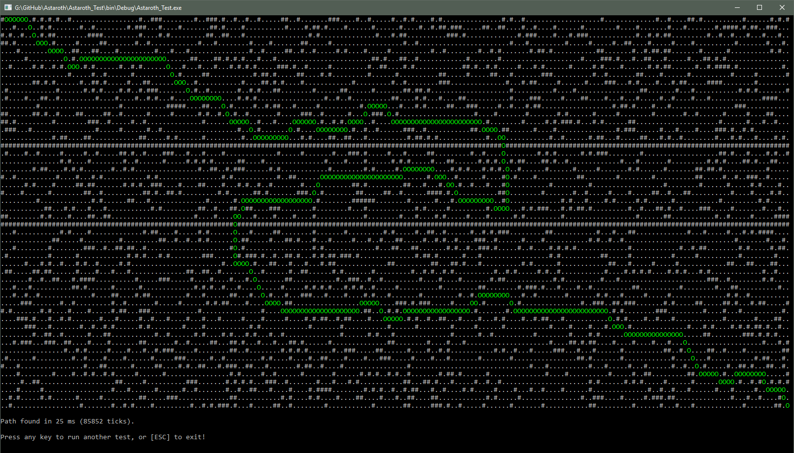

# Astaroth
Configurable, lightweight A* pathfinder library. Unity support.

Planned to be updated with new features (path merging, alternative path search, various optimizations) and other algorithms (like a graph-based Bellmann-Ford, etc.) as time goes by.

## Features

Astaroth currently supports only its original purpose, which is to be an extendable, A*-based pathfinding solution for 2D rectangular grid matrices. Custom rules and options can be defined for the iterative pre-sorting, passability check, and grid data propagation functions. Detailed examples for each usage will be added later.

Pre-sorting can be used to optimize the heuristic for specific tasks. Will be further optimized in the future.

Astaroth perfectly works with Unity (on .NET 4.x backend) either as a plugin (Astaroth.dll) or by adding the source files.

## Speed & efficiency

Console tests on 200x50 (10000) grids with custom passability check and simple pre-sorting produce result for the longest paths in 15-25 ms, and without pre-sorting in 10-20 ms. Unity Editor mode is about 4-5 times slower, but builds have the same efficiency.

## Usage

Work in progress, it's not production ready yet. See the source for function signatures. Astaroth_Test is a small example program to showcase things (see image below).

For now, you have to instantiate a *PathFinderRectGrid2D* or the enhanced *PFRG2D_Generic* pathfinder by passing a 2D boolean matrix as parameter representing basic passability data for each grid.

You can then access individual grids with the *GetPathNode(int x, int y)* class method, and use *SetProperty(string propertyName, T value)* to add more data to them.

*FindPath(...)* will return a *GridPath2D* instance. Check the count of its *Path* field or if the *PathEnd* field is not null to see if a path was found. You can access individual elements of the path found through Path (it's a list of PathNode2Ds). Nodes are in reverse order (first one is the end of the path), you may want to reverse it first.

